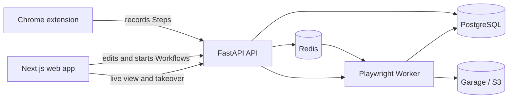

# Step by Step

Step by Step is an open-source, self-hosted browser automation tool. Its Chrome extension records semantic actions such as navigation, clicks, typing, selection, downloads, extraction, waits, and human takeover points. The web app lets you edit and version those Workflows, provide Variables, and inspect every Run.

When automation reaches something that requires a person—such as MFA, a CAPTCHA, or an unexpected page—you can take control of the Worker's browser and then hand it back. Screenshots, downloads, traces, logs, and extracted data are retained with the Run.

> [!WARNING]
> Step by Step is under active development and has not reached a stable release. APIs, configuration, and stored data may change without a migration path.

## Features

- **Browser recording** with a Chrome MV3 extension
- **Editable, versioned Workflows** made from semantic Steps rather than generated scripts
- **Reusable Variables and encrypted Secrets**, including per-member Personal Overrides
- **Saved browser Auth State** for authenticated sites
- **Manual, scheduled, and Batch Runs**
- **Human takeover** through a live view of the Worker's browser
- **Run history** with Step Results, logs, screenshots, downloads, traces, and extracted output
- **Selector fallback and drift detection** when pages change
- **Organizations and passwordless email sign-in**
- **Self-hosted storage and execution** using PostgreSQL, Redis, Garage, and isolated Playwright Workers

## How it works



A Workflow has one mutable **Draft**. Publishing the Draft creates an immutable **Version**, and Runs execute a Version. PostgreSQL is the source of truth; Redis carries dispatch and live-event hints; Garage stores Artifacts. Each Worker runs at most one browser at a time.

See [`docs/ARCHITECTURE.md`](docs/ARCHITECTURE.md) for the full system design and [`docs/GLOSSARY.md`](docs/GLOSSARY.md) for the project's domain language.

## Quick start

The quickest development setup runs the API, Worker, and backing services in Docker, with the web app on the host.

### Prerequisites

- Docker with Compose
- Node.js 24 or newer (the repository pins 24.18)
- pnpm 11.17 (the repository pins it through `packageManager`)
- Google Chrome or Chromium 118 or newer

### Run the project

```bash
git clone https://github.com/builtbystef/step-by-step.git
cd step-by-step

cp .env.example .env
pnpm install --frozen-lockfile

docker compose up -d --build
docker compose exec -w /app/apps/api api alembic upgrade head

API_URL=http://localhost:8001 pnpm --filter web dev
```

Open [http://localhost:3000](http://localhost:3000).

The default development mailer writes Sign-in Codes to the API log instead of sending email. Follow the log while signing in:

```bash
docker compose logs -f api
```

After signing in, open [http://localhost:3000/extension](http://localhost:3000/extension) and follow the instructions to load the recorder in Chrome.

Stop the stack with:

```bash
docker compose down
```

Data is retained in Docker volumes. To remove all local data as well, use `docker compose down -v`.

> [!IMPORTANT]
> The Compose defaults are for local development. They contain known credentials, use the console mailer, and do not configure TLS. Do not expose this setup to the internet unchanged.

## Development

For work across both the TypeScript and Python packages, install the complete toolchain:

- Node.js version from [`.node-version`](.node-version)
- Python version from [`.python-version`](.python-version)
- pnpm version from [`package.json`](package.json)
- uv version from [`pyproject.toml`](pyproject.toml)

```bash
pnpm install --frozen-lockfile
uv sync --locked --all-packages
cp .env.example .env
set -a; source .env; set +a

docker compose up -d
pnpm --filter api run migrate
pnpm dev
```

`pnpm dev` starts FastAPI on port 8000 and Next.js on port 3000. The Compose stack also exposes its containerized API on port 8001, PostgreSQL on 5433, Redis on 6380, and Garage's S3 API on 3910.

### Checks

```bash
pnpm check              # format, lint, and typecheck every package
pnpm test               # fast tests; no services or browser required
pnpm build              # build and regenerate the API contract
pnpm run ci              # check, test, and build
```

Additional test tiers:

```bash
pnpm test:integration   # requires the Compose stack and .env loaded
pnpm test:browser       # requires: uv run playwright install chromium
```

When an API endpoint changes, run `pnpm build` and commit the regenerated OpenAPI schema and typed client.

## Repository layout

```text
apps/
  api/          FastAPI backend and Alembic migrations
  extension/    Chrome MV3 recording extension
  web/          Next.js web application
  worker/       Playwright execution Worker
packages/
  api-client/   Generated TypeScript API client
  core/         Shared Python contracts and infrastructure seams
compose/        Service configuration
docs/           Architecture, glossary, standards, and ADRs
```

## Project docs

- [`AGENTS.md`](AGENTS.md) — repository commands and agent instructions
- [`docs/ARCHITECTURE.md`](docs/ARCHITECTURE.md) — system parts and their boundaries
- [`docs/GLOSSARY.md`](docs/GLOSSARY.md) — shared product terms
- [`docs/CODING_STANDARDS.md`](docs/CODING_STANDARDS.md) — rules not enforced by formatters or linters
- [`docs/adr/`](docs/adr/) — decisions that are costly to reverse
- [`docs/TRACKER.md`](docs/TRACKER.md) — Beaver Backlog commands used by this project

## Configuration

Copy [`.env.example`](.env.example) for application settings, development service URLs, and documented defaults. Important production-facing settings include:

- `STEPBYSTEP_MASTER_KEY` — encrypts Secrets and Auth State; losing it makes those values unrecoverable
- `INTERNAL_TOKEN` — authenticates Worker-to-API requests
- `VNC_CONTROL_PASSWORD` and `VNC_VIEW_PASSWORD` — protect Worker browser access
- `SIGNUP_MODE` — use `invite_only` for a private instance
- `MAILER` — `console`, `smtp`, or `resend`
- `S3_*` — Artifact storage credentials and endpoints

Before operating an internet-facing instance, replace every development credential, configure real email delivery, put the application behind TLS, and arrange backups for PostgreSQL and Artifact storage.

## License

Step by Step is available under the [MIT License](LICENSE).
